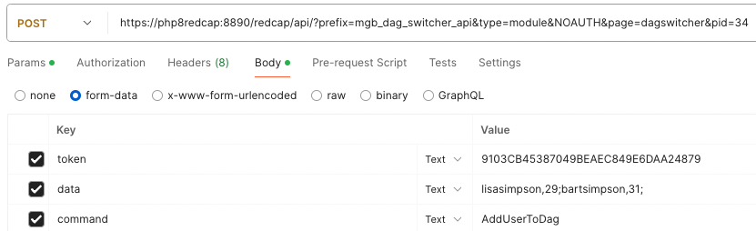

# MgbDagSwitcherApi - DAG manager allowing API usage to control User and DAG SWITCHER assignment.

An external module using API commands to ADD or REMOVE a user from a DAG Switcher selection.

********************************************************************************

## Version

Version 1.0.2

********************************************************************************

## Release notes

1.0.2 Update doc and use of GetDagsByUser to specify one user name and no semicolon.

1.0.1 Minor bug fix with leading quote need trim from input.

1.0.0 Initial Release.

********************************************************************************

## Getting Started

********************************************************************************

### Prerequisites

********************************************************************************

### Installing

********************************************************************************

### Problem Situation

* DAG Switcher is a very useful concept.  An issue arises, when that project has
lots of data, lots of users, lots of DAGs, and the sum of all the underlying data,
creates a difficult situation, where, the easy to use front end controls, take an
enormous amount of time, simply to render the page, let alone, manage anything.

* The ease of use becomes prohibitively cumbersome with a massive data project.

* A possible solution, is utilize, API calls and reduce the process burden in a
less intensive resource use by being more direct.

* It will be necessary to both know the USER and the DAG IDs involved.  These 
elements should be information that is available already as a course of operation.
The DAG IDs can be found with a query or from a known list.  And the user is 
known of course as given to be modified by requests of the projects management. 
And also, available in the system elsewhere.

### Overview

* Using API calls, can help manage a User and their DAG Switcher settings.

* Commands to ADD, REMOVE, Get List for a User, Get List of DAG IDs and DAG names.

* REQUIRES 
    - an API token from the project
    - the Project ID
    - the command
    - the data for the command
    - and other API params to access the EM API: prefix, type, page, and specify NOAUTH

********************************************************************************

### Operation

* API usage:
    - POST
    - form-data

* body: 
    - token: API Token
    - command: 
        - GetDagsByProject
        - GetDagsByUser
        - AddUserToDag
        - RemoveUserFromDag
    - data: 
        - GetDagsByProject: NA, 
        - GetDagsByUser: user, 
        - AddUserToDag: user,dagid;  repeat, 
            - ( using semi colon to separate pairs: user,dagID;user,dagID;.... OR user,dagID; OR user,dagID )
        - RemoveUserFromDag: user,dagid;  repeat

* params: 
    - prefix: mgb_dag_switcher_api
    - type: module
    - NOAUTH
    - page: dagswitcher
    - pid: ( PER PROJECT ID )

* Commands:
    - GetDagsByProject
    - GetDagsByUser
    - AddUserToDag
    - RemoveUserFromDag

* GetDagsByProject 
    - get the full project listing DAG IDs and DAG names
    - ( command ) GetDagsByProject
    - lists DAG IDs and DAG Names
    - RETURNS: JSON: daglist  key = DAG ID, val = DAG Name
 
* GetDagsByUser 
    - list user and DAG IDs
    - ( command ) GetDagsByUser
    - ( find a user and what active DAG enabled )
    - given user name only ( one single name and no semicolon )
    - get User, DAG_IDs
    - RETURNS: JSON: user: user name, dags: DAG IDs list

* AddUserToDag  
    - ADD a user to DAG
    - ( command ) AddUserToDag
    - ( data )  formatted:  user,dagid;  repeat
    - changes the users dagID list, enabling, as per DAGSwitcher
    - RETURNS: JSON: user dag list: [user name, dags: DAG IDs list]

* RemoveUserFromDag  
    - REMOVE a user from DAG
    - ( command ) RemoveUserFromDag
    - ( data )  formatted:  user,dagid;  repeat
    - changes the users dagID list, disabling, as per DAGSwitcher
    - RETURNS: JSON: user dag list: [user name, dags: DAG IDs list]

*****************

# DAG Switcher Screen 

* settings we want to affect with our API calls

## DAG Switcher View   

## Database table affected

******************

# API POST PARAMS

* params: 
    - prefix: mgb_dag_switcher_api
    - type: module
    - NOAUTH
    - page: dagswitcher
    - pid: ( PER PROJECT ID )

# API POST BODY RemoveUserFromDag
        

### Command Results: RemoveUserFromDag

# API AddUserToDag

### Command Results: AddUserToDag

# API GetDagsByUser

### Command Results: GetDagsByUser

# API GetDagsByProject

### Command Results: GetDagsByProject

******************

### Set up issues

********************************************************************************

### Deployment

Regular external module enable and configuration.

********************************************************************************
## Information
 

********************************************************************************
### Authors

* **David Heskett** - *Initial work* - 

### License

This project is licensed under the MIT License - see the [LICENSE](?prefix=mgb_dag_switcher_api&page=LICENSE.md) file for details

### Acknowledgments

* Inspired by MGB RISC REDCap Team.

